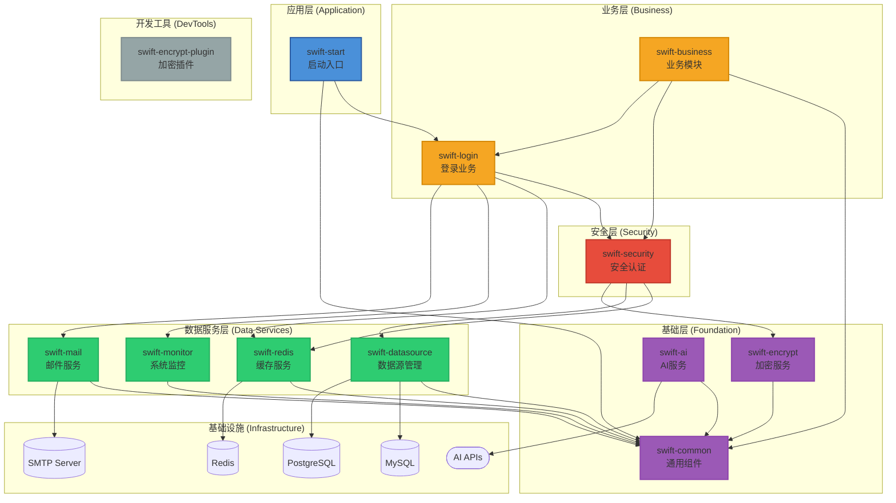

# SwiftFrame 快速开发框架

SwiftFrame 是一个基于 **Spring Boot 3.5** 和 **Java 21** 构建的企业级多模块快速开发框架。它集成了多数据源管理、自动化加解密、安全认证、AI集成、系统监控等核心功能，旨在为开发者提供一个开箱即用、高度可扩展的基础架构。

---

## 🚀 核心特性

### 数据管理
- **多数据源支持**：同时支持 MySQL 和 PostgreSQL 数据源，通过不同的 Mapper 包路径自动路由
- **高效 ORM 增强**：集成 MyBatis-Plus 3.5+，提供更简洁的数据库操作体验
- **Redis 缓存集成**：内置 Redis 缓存服务封装，支持分布式缓存场景

### 安全防护
- **配置加密**：基于 Jasypt 的配置文件敏感信息加密
- **数据加解密**：内置 AES (GCM) 和 RSA 加解密工具类，并提供专用的 Maven 插件（`swift-encrypt-plugin`）用于配置文件的自动加解密
- **安全认证**：集成 Spring Security 和 JWT，支持灵活的权限校验与白名单配置
- **RBAC 权限模型**：内置用户、角色、权限三级权限管理体系

### AI 集成
- **多 AI 提供商支持**：支持 OpenAI、DeepSeek 等主流 AI 服务
- **流式响应**：支持 AI 流式输出，提升用户体验
- **统一接口**：提供统一的 AI 调用接口，便于切换不同 AI 服务

### 系统监控
- **健康检查**：基于 Spring Boot Actuator 提供全面的健康检查
- **性能指标**：自动采集应用性能指标
- **Prometheus 集成**：支持 Prometheus 监控数据采集
- **自定义监控**：提供自定义健康指标扩展能力

### 开发体验
- **容器化部署**：全套 Docker / Docker-Compose 部署方案，支持一键启动应用及其依赖环境
- **API 文档自动化**：集成 SpringDoc OpenAPI 3 (Swagger UI)，自动生成交互式 API 接口文档
- **完善的响应封装**：统一的响应结果封装，支持普通响应和分页响应
- **全局异常处理**：统一的异常处理机制，提供友好的错误信息
- **邮件服务**：内置邮件发送功能，支持 SMTP 协议

---

## 📂 项目结构

```text
SwiftFrame/
├── swift-common/           # 公共基础模块（工具类、结果对象、全局异常处理、OpenAPI配置）
├── swift-datasource/       # 数据源模块（动态数据源配置、多数据库驱动支持）
├── swift-encrypt/          # 加解密模块（AES/RSA 实现、Jasypt 配置）
├── swift-encrypt-plugin/   # 加解密 Maven 插件（用于自动化加密配置文件）
├── swift-redis/            # Redis 缓存模块
├── swift-monitor/          # 系统监控模块（健康检查、性能指标、Prometheus集成）
├── swift-security/         # 安全认证模块（Security 配置、JWT 实现、权限控制）
├── swift-ai/               # AI 通用调用模块（支持 OpenAI 兼容接口）
├── swift-login/            # 登录业务模块（用户认证、登录接口）
├── swift-business/         # 默认业务模块（业务逻辑实现）
├── swift-mail/             # 邮件服务模块
└── swift-start/            # 启动模块（主启动类、配置文件、静态资源）
```

## 🏗️ 系统架构



### 分层说明

#### 应用层
- **swift-start**: 应用启动入口，依赖业务层和基础层模块

#### 业务层
- **swift-login**: 用户登录、认证、注册等业务逻辑
- **swift-business**: 默认业务模块，提供业务逻辑实现

#### 安全层
- **swift-security**: 基于 Spring Security 和 JWT 的认证授权、权限控制
  - 依赖：swift-redis、swift-datasource、swift-encrypt
  - 功能：用户认证、JWT 令牌管理、RBAC 权限控制、白名单配置

#### 数据服务层
- **swift-datasource**: 多数据源支持（MySQL/PostgreSQL）、MyBatis Plus 集成
  - 依赖：swift-common
  - 功能：多数据源配置、独立的 SqlSessionFactory
- **swift-redis**: Redis 缓存服务封装
  - 依赖：swift-common
  - 功能：Redis 连接管理、缓存操作封装
- **swift-monitor**: 系统监控模块，基于 Spring Boot Actuator 提供健康检查、性能指标采集、Prometheus 集成
  - 依赖：swift-common
  - 功能：健康检查、性能指标、Prometheus 导出、自定义健康指标
- **swift-mail**: 邮件服务模块
  - 依赖：swift-common
  - 功能：SMTP 邮件发送、邮件模板支持

#### 基础层
- **swift-common**: 通用工具类、统一响应结果（PubResult、PageResult）、全局异常处理、OpenAPI 配置
  - 功能：雪花 ID 生成器、统一响应封装、全局异常处理、OpenAPI 配置
- **swift-encrypt**: AES/RSA 加解密工具、Jasypt 配置加密
  - 依赖：swift-common
  - 功能：AES 加密、RSA 加密、配置文件加密
- **swift-ai**: OpenAI 兼容接口的 AI 通用调用工具，支持流式响应
  - 依赖：swift-common
  - 功能：多 AI 提供商支持、流式响应、统一调用接口

#### 开发工具
- **swift-encrypt-plugin**: Maven 插件，用于构建时配置文件的自动加解密

**架构原则**: 
- 依赖单向向下，高层模块依赖低层模块，禁止跨层调用
- 各模块内部集成自动配置能力，开箱即用
- 模块职责单一，高内聚低耦合

---

## 🛠️ 技术栈

### 核心框架
- **后端**: Java 21, Spring Boot 3.5.0
- **安全**: Spring Security 6.5, JJWT 0.12.6, Jasypt 3.0.5

### 数据存储
- **数据库**: MySQL 8.4, PostgreSQL 15
- **缓存**: Redis 7.0
- **连接池**: Druid 1.2.23
- **ORM**: MyBatis-Plus 3.5.12

### AI 集成
- **OpenAI**: GPT-4o 等模型
- **DeepSeek**: deepseek-chat 等模型
- **自定义**: 支持自定义 OpenAI 兼容接口

### 监控与文档
- **监控**: Spring Boot Actuator, Prometheus
- **文档**: SpringDoc OpenAPI 3 (Swagger UI)

### 开发工具
- **构建工具**: Maven 3.9
- **代码简化**: Lombok
- **加密算法**: AES (GCM), RSA

---

## 🏁 快速开始

### 1. 环境准备

- **JDK 21**
- **Maven 3.9+**
- **Docker & Docker Compose** (可选，用于快速部署)

### 2. 本地运行

1. **克隆项目**：
    ```bash
    git clone https://github.com/SHOOTING-STAR-C/SwiftFrame.git
    cd SwiftFrame
    ```

2. **安装依赖并编译**：
    ```bash
    mvn clean install -DskipTests
    ```

3. **配置数据库**：
    修改 `swift-start/src/main/resources/application-dev.yml` 中的数据库连接信息：
    ```yaml
    spring:
      datasource:
        mysql:
          url: jdbc:mysql://localhost:3306/swift?useUnicode=true&characterEncoding=utf8&useSSL=false&serverTimezone=Asia/Shanghai
          username: root
          password: root
        postgresql:
          url: jdbc:postgresql://localhost:5432/swift
          username: postgres
          password: root
      data:
        redis:
          host: localhost
          port: 6379
    ```

4. **启动应用**：
    运行 `com.star.swiftStart.SwiftStartApplication`

5. **访问应用**：
    - 应用地址：`http://localhost:8081/swift`
    - Swagger UI：`http://localhost:8081/swift/swagger-ui.html`
    - 健康检查：`http://localhost:8081/swift/actuator/health`

---

## 🐳 Docker 部署

项目支持使用 `docker-compose` 一键启动完整环境：

1. **启动服务**：
    ```bash
    docker-compose up -d --build
    ```

2. **服务说明**：
    - **Application**: `http://localhost:8081/swift`
    - **MySQL**: `localhost:3306` (用户/密码: root/root)
    - **PostgreSQL**: `localhost:5432` (用户/密码: postgres/root)
    - **Redis**: `localhost:6379`
    - **Swagger UI**: `http://localhost:8081/swift/swagger-ui.html`
    - **健康检查**: `http://localhost:8081/swift/actuator/health`

3. **停止服务**：
    ```bash
    docker-compose down
    ```

---

## 🔐 核心功能说明

### 多数据源使用

框架支持同时配置 MySQL 和 PostgreSQL 数据源，通过不同的 Mapper 包路径自动路由到对应的数据源：

**1. MySQL 数据源 Mapper**
```java
// 包路径：com.star.**.mapper.mysql
package com.star.swiftSecurity.mapper.mysql;

@Mapper
public interface SwiftUserMapper extends BaseMapper<SwiftUser> {
    // 自动使用 MySQL 数据源
}
```

**2. PostgreSQL 数据源 Mapper**
```java
// 包路径：com.star.**.mapper.postgresql
package com.star.swiftSecurity.mapper.postgresql;

@Mapper
public interface PgUserMapper extends BaseMapper<PgUser> {
    // 自动使用 PostgreSQL 数据源
}
```

**3. 配置说明**
- MySQL Mapper 扫描路径：`com.star.**.mapper.mysql`
- PostgreSQL Mapper 扫描路径：`com.star.**.mapper.postgresql`
- 每个数据源有独立的 SqlSessionFactory 和配置
- 通过包路径自动识别并路由到对应的数据源

### 配置文件加密

使用 `swift-encrypt-plugin` 插件对配置文件中的敏感信息进行加密：

1. **加密配置**：
    ```bash
    mvn swift-encrypt-plugin:encrypt -Dfile=application-dev.yml
    ```

2. **解密配置**：
    ```bash
    mvn swift-encrypt-plugin:decrypt -Dfile=application-dev.yml
    ```

3. **配置示例**：
    ```yaml
    spring:
      datasource:
        password: ENC(加密后的密码)
    ```

### AI 服务调用

使用统一的 AI 服务接口调用 AI 功能：

```java
@Autowired
private AiService aiService;

public void chatWithAI() {
    // 构建消息
    List<Message> messages = List.of(
        new Message("user", "你好，请介绍一下 SwiftFrame")
    );
    
    // 调用 AI 服务
    ChatResponse response = aiService.chat(messages);
    
    // 流式响应
    aiService.streamChat(messages, chunk -> {
        System.out.println(chunk.getContent());
    });
}
```

### 安全认证

框架内置了完整的安全认证体系：

1. **用户登录**：
    ```java
    POST /swift/auth/login
    {
        "username": "admin",
        "password": "123456"
    }
    ```

2. **JWT 令牌**：
    - 访问令牌有效期：2小时（可配置）
    - 刷新令牌有效期：7天（可配置）

3. **权限控制**：
    ```java
    @PreAuthorize("hasAuthority('user:read')")
    public List<User> getUsers() {
        return userService.list();
    }
    ```

### 系统监控

框架提供了丰富的监控端点：

- **健康检查**：`/actuator/health`
- **应用信息**：`/actuator/info`
- **性能指标**：`/actuator/metrics`
- **Prometheus**：`/actuator/prometheus`
- **环境信息**：`/actuator/env`
- **日志级别**：`/actuator/loggers`
- **线程转储**：`/actuator/threaddump`
- **堆转储**：`/actuator/heapdump`

---

## 📊 数据库设计

### 核心表结构

框架内置了完整的 RBAC 权限管理体系：

- **swift_user**: 用户表
- **swift_role**: 角色表
- **swift_authority**: 权限表
- **swift_user_role**: 用户角色关联表
- **swift_role_authority**: 角色权限关联表

### 初始化数据

系统启动时会自动初始化以下数据：

- 默认管理员账号：`admin` / `123456`
- 默认角色：`ROLE_ADMIN`, `ROLE_USER`
- 默认权限：完整的权限体系

---

## 📝 配置说明

### 环境配置

项目支持多环境配置：

- **开发环境**：`application-dev.yml`
- **测试环境**：`application-test.yml`
- **生产环境**：`application-prod.yml`

### Maven Profile

使用 Maven Profile 切换环境：

```bash
# 开发环境（默认）
mvn clean package

# 测试环境
mvn clean package -Ptest

# 生产环境
mvn clean package -Pprod
```

### 核心配置项

```yaml
swift:
  # 安全配置
  security:
    auth:
      white-list: /auth/publicKey,/auth/login,/auth/register
  
  # AI 配置
  ai:
    enabled: true
    default-provider: openai
    providers:
      openai:
        enabled: true
        api-key: your-openai-api-key
        base-url: https://api.openai.com
        model: gpt-4o
  
  # 监控配置
  monitor:
    enabled: true
```

---

## 📚 文档

- **更新日志**：[CHANGELOG.md](CHANGELOG.md)
- **Mapper 包结构说明**：[docs/Mapper包结构说明.md](docs/Mapper包结构说明.md)
- **邮件配置指南**：[docs/mail-configuration-guide.md](docs/mail-configuration-guide.md)
- **API 文档**：启动应用后访问 `/swagger-ui.html`

---

## 🤝 贡献指南

欢迎贡献代码、报告问题或提出建议！

1. Fork 本仓库
2. 创建特性分支 (`git checkout -b feature/AmazingFeature`)
3. 提交更改 (`git commit -m 'Add some AmazingFeature'`)
4. 推送到分支 (`git push origin feature/AmazingFeature`)
5. 开启 Pull Request

---

## 📋 更新日志

详细的版本更新和 Bug 修复记录请查看：[CHANGELOG.md](CHANGELOG.md)

---

## 📜 许可证

[GNU Affero General Public License v3.0 (AGPL-3.0)](LICENSE)

---

## 🙏 致谢

感谢所有为 SwiftFrame 做出贡献的开发者！

---

## 📮 联系方式

- **项目地址**：https://github.com/SHOOTING-STAR-C/SwiftFrame
- **问题反馈**：https://github.com/SHOOTING-STAR-C/SwiftFrame/issues

---

**SwiftFrame** - 让开发更快速，让架构更优雅！
