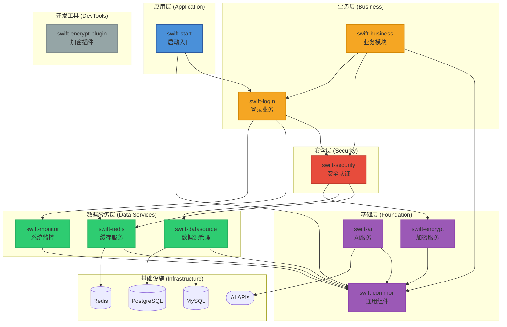

# SwiftFrame 快速开发框架

SwiftFrame 是一个基于 **Spring Boot 3.5** 和 **Java 21** 构建的多模块快速开发框架。它集成了多数据源管理、自动化加解密、安全认证等核心功能，旨在为开发者提供一个开箱即用、高度可扩展的基础架构。

---

## 🚀 核心特性

-   **多数据源动态切换**：支持 MySQL 和 PostgreSQL 的动态路由，支持基于注解（`@UDS`）的手动切换及读写分离扩展。
-   **全方位安全防护**：
    -   **配置加密**：基于 Jasypt 的配置文件敏感信息加密。
    -   **数据加解密**：内置 AES (GCM) 和 RSA 加解密工具类，并提供专用的 Maven 插件（`swift-encrypt-plugin`）用于配置文件的自动加解密。
    -   **安全认证**：集成 Spring Security 和 JWT，支持灵活的权限校验与白名单配置。
-   **高效 ORM 增强**：集成 MyBatis-Plus 3.5+，提供更简洁的数据库操作体验。
-   **容器化部署**：全套 Docker / Docker-Compose 部署方案，支持一键启动应用及其依赖环境。
-   **API 文档自动化**：集成 SpringDoc OpenAPI 3 (Swagger UI)，自动生成交互式 API 接口文档。
-   **完善的响应封装**：统一的响应结果封装，支持普通响应和分页响应。

---

## 📂 项目结构

```text
SwiftFrame/
├── swift-common/           # 公共基础模块（工具类、结果对象、全局异常处理等）
├── swift-datasource/       # 数据源模块（动态数据源配置、多数据库驱动支持）
├── swift-encrypt/          # 加解密模块（AES/RSA 实现、Jasypt 配置）
├── swift-encrypt-plugin/   # 加解密 Maven 插件（用于自动化加密配置文件）
├── swift-redis/            # Redis 缓存模块
├── swift-monitor/          # 系统监控模块（健康检查、性能指标、Prometheus集成）
├── swift-security/         # 安全认证模块（Security 配置、JWT 实现、权限控制）
├── swift-ai/               # AI 通用调用模块（支持 OpenAI 兼容接口）
├── swift-login/            # 登录业务模块（用户认证、登录接口）
├── swift-business/         # 默认业务模块（业务逻辑实现）
└── swift-start/            # 启动模块（主启动类、配置文件、静态资源）
```

## 🏗️ 系统架构



### 分层说明

- **应用层**
  - **swift-start**: 应用启动入口，依赖业务层和基础层模块

- **业务层**
  - **swift-login**: 用户登录、认证等业务逻辑
  - **swift-business**: 默认业务模块，提供业务逻辑实现

- **安全层**
  - **swift-security**: 基于 Spring Security 和 JWT 的认证授权、权限控制
    - 依赖：swift-redis、swift-datasource、swift-encrypt

- **数据服务层**
  - **swift-datasource**: 多数据源动态切换（MySQL/PostgreSQL）、MyBatis Plus 集成
    - 依赖：swift-common
  - **swift-redis**: Redis 缓存服务封装
    - 依赖：swift-common
  - **swift-monitor**: 系统监控模块，基于 Spring Boot Actuator 提供健康检查、性能指标采集、Prometheus集成
    - 依赖：swift-common

- **基础层**
  - **swift-common**: 通用工具类、统一响应结果（PubResult、PageResult）、全局异常处理、OpenAPI 配置
  - **swift-encrypt**: AES/RSA 加解密工具、Jasypt 配置加密
    - 依赖：swift-common
  - **swift-ai**: OpenAI 兼容接口的 AI 通用调用工具，支持流式响应
    - 依赖：swift-common

- **开发工具**
  - **swift-encrypt-plugin**: Maven 插件，用于构建时配置文件的自动加解密

**架构原则**: 
- 依赖单向向下，高层模块依赖低层模块，禁止跨层调用
- 各模块内部集成自动配置能力，开箱即用
- 模块职责单一，高内聚低耦合

---

## 🛠️ 技术栈

-   **后端**: Java 21, Spring Boot 3.5.0
-   **数据库**: MySQL 8.4, PostgreSQL 15
-   **中间件**: Redis 7.0
-   **ORM**: MyBatis-Plus 3.5.12
-   **安全**: Spring Security 6.5, JJWT 0.12.6, Jasypt 3.0.5
-   **工具**: Druid 1.2.23, Lombok, Maven 3.9

---

## 🏁 快速开始

### 1. 环境准备

-   JDK 21
-   Maven 3.9+
-   Docker & Docker Compose (可选，用于快速部署)

### 2. 本地运行

1.  克隆项目：
    ```bash
    git clone https://github.com/SHOOTING-STAR-C/SwiftFrame.git
    cd SwiftFrame
    ```
2.  安装依赖并编译：
    ```bash
    mvn clean install -DskipTests
    ```
3.  配置数据库：修改 `swift-start/src/main/resources/application-dev.yml` 中的数据库连接信息。
4.  启动应用：运行 `com.star.swiftStart.SwiftStartApplication`。

---

## 🐳 Docker 部署

项目支持使用 `docker-compose` 一键启动完整环境：

1.  在根目录下执行：
    ```bash
    docker-compose up -d --build
    ```
2.  服务说明：
    -   **Application**: `http://localhost:8081`
    -   **MySQL**: `localhost:3306` (用户/密码: root/root)
    -   **PostgreSQL**: `localhost:5432` (用户/密码: postgres/root)
    -   **Redis**: `localhost:6379`
    -   **Swagger UI**: `http://localhost:8081/swagger-ui.html`

---

## 🔐 核心功能说明

### 动态数据源切换

在 Service 或 Mapper 方法上使用 `@UDS` 注解即可轻松切换数据源：

```java
@UDS(DataSourceEnum.PG) // 切换到 PostgreSQL 数据源
public List<User> selectFromPg() {
    return userMapper.selectList(null);
}
```

### 配置文件加密

可以使用 `swift-encrypt-plugin` 插件对配置文件中的敏感信息进行加密，确保代码托管平台的安全性。

---

## 📋 更新日志

详细的版本更新和Bug修复记录请查看：[CHANGELOG.md](CHANGELOG.md)

---

## 📜 许可证

[GNU Affero General Public License v3.0 (AGPL-3.0)](LICENSE)
