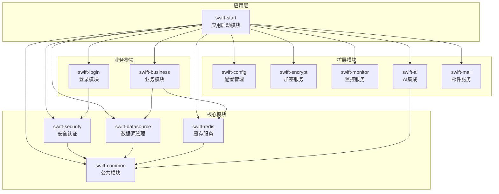
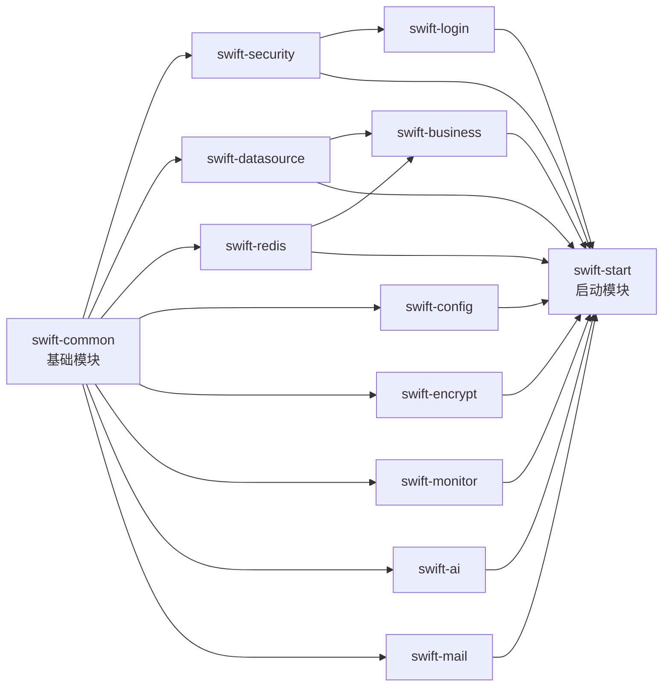

# SwiftFrame

<div align="center">


一个现代化的企业级Java开发框架，基于Spring Boot构建，提供模块化、可扩展的解决方案

[特性](#特性) • [快速开始](#快速开始) • [模块介绍](#模块介绍) • [文档](#文档)

</div>

---

## 📖 简介

SwiftFrame是一个轻量级但功能强大的企业级开发框架，采用模块化设计理念，将常用功能封装为独立模块。开发者可以根据需求灵活组合使用，无需引入不必要的依赖。框架集成了认证授权、数据访问、缓存、监控、AI等企业应用所需的核心能力，帮助开发者快速构建高质量的应用程序。

## 🏗️ 项目架构

### 整体架构图



### 模块依赖关系



### 项目目录结构

```
SwiftFrame/
├── swift-common/          # 公共模块（基础工具类、响应封装等）
├── swift-security/        # 安全认证模块（JWT、RBAC权限控制）
├── swift-datasource/      # 数据源模块（多数据源、MyBatis Plus）
├── swift-redis/          # Redis缓存模块
├── swift-config/         # 配置管理模块
├── swift-encrypt/        # 加密服务模块（AES、RSA）
├── swift-monitor/        # 监控服务模块（Actuator、Prometheus）
├── swift-ai/             # AI集成模块（OpenAI等）
├── swift-mail/           # 邮件服务模块
├── swift-login/          # 登录模块
├── swift-business/       # 业务模块
├── swift-start/          # 启动模块（应用入口）
├── swift-encrypt-plugin/ # 加密插件
├── pom.xml               # Maven父POM
├── docker-compose.yml    # Docker编排文件
├── Dockerfile            # Docker镜像构建文件
└── README.md             # 项目文档
```

## ✨ 特性

- 🧩 **模块化设计** - 各功能模块独立，按需引入，降低项目复杂度
- 🔐 **完善的安全体系** - 基于JWT和RBAC的认证授权机制
- 🤖 **AI能力集成** - 支持多种AI提供商（OpenAI等）
- 📊 **监控与健康检查** - 集成Actuator，提供全面的系统监控
- 🔒 **配置加密** - 支持敏感配置加密存储
- 📧 **邮件服务** - 统一的邮件发送接口
- 💾 **多数据源支持** - 支持MySQL、PostgreSQL等主流数据库
- 🚀 **开箱即用** - 提供完整的配置和初始化脚本
- 📝 **完善的文档** - 详细的使用文档和示例代码

## 🛠️ 技术栈

| 技术 | 版本 | 说明 |
|------|------|------|
| Java | 21 | 编程语言 |
| Spring Boot | 3.5.1 | 应用框架 |
| MyBatis Plus | 3.5.12 | ORM框架 |
| MySQL | 9.3.0 | 关系型数据库 |
| PostgreSQL | 12+ | 关系型数据库 |
| Druid | 1.2.23 | 数据库连接池 |
| Redis | - | 缓存和会话存储 |
| Spring Security | 6.5.0 | 安全框架 |
| JJWT | 0.12.6 | JWT令牌处理 |
| Jasypt | 3.0.5 | 配置加密 |
| Actuator | 3.5.0 | 应用监控 |
| SpringDoc | 2.8.1 | API文档 |

## 📦 模块介绍

### 核心模块（必选）

#### swift-common
公共模块，提供通用功能和工具类
- 统一响应结果封装（`PubResult`、`PageResult`）
- 全局异常处理（`GlobalExceptionHandler`）
- 业务异常定义（`BusinessException`）
- 雪花ID生成器（`SnowflakeIdGenerator`）
- OpenAPI配置

#### swift-security
安全认证模块，基于Spring Security和JWT
- JWT令牌生成和验证
- 用户认证和授权
- 基于RBAC的权限控制
- 账户安全策略（密码加密、账户锁定等）
- 用户缓存管理
- 提供完整的用户、角色、权限实体和接口

#### swift-datasource
数据源模块，提供数据库访问能力
- 多数据源支持
- MyBatis Plus集成
- SQL映射文件管理
- 数据库连接池配置

#### swift-redis
Redis缓存模块
- Redis自动配置
- 缓存操作工具
- 分布式锁支持

### 扩展模块（可选）

#### swift-encrypt
加密模块，提供数据加密能力
- AES加密
- RSA加密
- 自定义加密算法扩展

#### swift-config
配置管理模块
- 统一配置管理
- 配置热加载
- 配置验证

#### swift-monitor
监控模块
- 应用性能监控
- 系统健康检查
- Prometheus指标导出
- 日志管理

#### swift-ai
AI集成模块，支持多种AI提供商
- 统一的AI服务接口
- 支持OpenAI等
- 流式对话支持
- 工具调用能力
- 提供商注册和管理机制

#### swift-mail
邮件服务模块
- 统一邮件发送接口
- 支持SMTP协议
- 邮件模板支持

### 业务模块（可选）

#### swift-login
登录模块
- 统一登录接口
- 多种登录方式支持
- 登录状态管理

#### swift-business
业务模块
- 提供业务实体和服务
- 业务逻辑封装

### 启动模块（必选）

#### swift-start
启动模块，应用入口
- 应用主类
- 配置文件
- 日志配置
- 数据库初始化脚本

## 🚀 快速开始

### 前置要求

- JDK 21+
- Maven 3.8+
- MySQL 8.0+ 或 PostgreSQL 12+
- Redis 6.0+（可选）

### 构建项目

```bash
# 克隆项目
git clone https://github.com/SHOOTING-STAR-C/SwiftFrame.git
cd SwiftFrame

# 编译打包
mvn clean package -DskipTests

# 指定环境打包
mvn clean package -P dev -DskipTests
```

### 环境配置

项目支持多环境配置，通过Maven Profile切换：

```bash
# 开发环境（默认）
mvn spring-boot:run -P dev

# 测试环境
mvn spring-boot:run -P test

# 生产环境
mvn spring-boot:run -P prod
```

**配置文件说明**：

为了保护敏感信息，项目使用环境变量配置方式：

1. **复制配置模板**：
   ```bash
   cp swift-start/src/main/resources/application.yml.example swift-start/src/main/resources/application-dev.yml
   cp swift-start/src/main/resources/application.yml.example swift-start/src/main/resources/application-prod.yml
   cp swift-start/src/main/resources/application.yml.example swift-start/src/main/resources/application-test.yml
   ```

2. **配置环境变量**：
   - 方式一：在配置文件中直接替换占位符（不推荐用于生产环境）
   - 方式二：设置系统环境变量（推荐）
   - 方式三：使用 `.env` 文件（需要配置加载）

3. **环境变量列表**：

   | 变量名 | 说明 | 默认值 | 示例 |
   |--------|------|--------|------|
   | `DB_HOST` | MySQL数据库地址 | localhost | 127.0.0.1 |
   | `DB_USERNAME` | MySQL用户名 | root | swift_user |
   | `DB_PASSWORD` | MySQL密码 | - | your_password |
   | `PG_HOST` | PostgreSQL数据库地址 | localhost | 127.0.0.1 |
   | `PG_USERNAME` | PostgreSQL用户名 | postgres | postgres |
   | `PG_PASSWORD` | PostgreSQL密码 | - | your_password |
   | `REDIS_HOST` | Redis地址 | localhost | 127.0.0.1 |
   | `REDIS_PORT` | Redis端口 | 6379 | 6379 |
   | `REDIS_PASSWORD` | Redis密码 | - | your_password |
   | `MAIL_HOST` | 邮件服务器地址 | smtp.example.com | smtp.gmail.com |
   | `MAIL_PORT` | 邮件服务器端口 | 587 | 587 |
   | `MAIL_USERNAME` | 邮件用户名 | your_email@example.com | your_email@gmail.com |
   | `MAIL_PASSWORD` | 邮件密码 | - | your_app_password |
   | `JWT_SECRET` | JWT密钥 | - | your_secret_key_change_this |
   | `AES_KEY` | AES加密密钥 | - | your_256_bit_key |
   | `RSA_PUBLIC_KEY` | RSA公钥 | - | MIIBIjANBgk... |
   | `RSA_PRIVATE_KEY` | RSA私钥 | - | MIIEvQIBADANBgk... |

**安全提示**：
- ⚠️ 不要将包含真实密码的配置文件提交到Git仓库
- ⚠️ 生产环境必须使用强密码和密钥
- ⚠️ 建议使用密钥管理服务（如AWS Secrets Manager、HashiCorp Vault）
- ✅ 项目已将敏感配置文件添加到 `.gitignore`

### 数据库初始化

项目启动时会自动执行数据库初始化，包括表结构创建和初始数据导入，无需手动执行SQL脚本。

**注意**：首次启动前请确保数据库已创建并配置好连接信息。

### 启动应用

```bash
# 使用Maven启动
mvn spring-boot:run -pl swift-start

# 或使用jar包启动
java -jar swift-start/target/swift-start-1.0.jar
```

### 访问应用

- 应用地址: http://localhost:8081/swift
- API文档: http://localhost:8081/swift/swagger-ui.html
- 健康检查: http://localhost:8081/swift/actuator/health
- Prometheus指标: http://localhost:8081/swift/actuator/prometheus

## 🔧 配置说明

### 应用配置（application.yml）

```yaml
app:
  name: SWIFT
server:
  port: 8081
  servlet:
    context-path: /swift

spring:
  profiles:
    active: @app.env@
```

### 加密配置

使用Jasypt加密敏感配置：

**在配置文件中使用加密值**：
```yaml
spring:
  datasource:
    password: ENC(加密后的字符串)
```

## 📊 监控指标

框架集成了Actuator，提供以下监控端点：

- `/actuator/health` - 健康检查
- `/actuator/metrics` - 应用指标
- `/actuator/prometheus` - Prometheus格式指标
- `/actuator/env` - 环境信息
- `/actuator/loggers` - 日志配置
- `/actuator/threaddump` - 线程转储
- `/actuator/heapdump` - 堆转储

## 🐳 Docker部署

### 使用Docker Compose

```bash
# 启动数据库和Redis
docker-compose up -d

# 构建并启动应用
docker build -t swiftframe:latest .
docker run -p 8081:8081 swiftframe:latest
```

## ❓ 常见问题

### 1. 如何快速创建一个新的模块？

在项目根目录下执行：
```bash
# 创建新模块目录
mkdir swift-new-module

# 添加到父POM的modules中
# 创建pom.xml，继承父POM
# 实现模块功能
```

### 2. 如何自定义AI提供商？

参考`swift-ai`模块中的示例，实现`Provider`接口并添加`@ProviderAdapter`注解。

### 3. 如何配置多数据源？

在`application.yml`中配置多个数据源，具体配置示例请参考配置文件模板。

### 4. 如何启用监控功能？

监控功能默认开启，访问以下端点查看：
- 健康检查：`http://localhost:8081/swift/actuator/health`
- 指标数据：`http://localhost:8081/swift/actuator/metrics`

## 🤝 贡献

欢迎贡献代码、报告问题或提出建议！

1. Fork本仓库
2. 创建特性分支 (`git checkout -b feature/AmazingFeature`)
3. 提交更改 (`git commit -m 'Add some AmazingFeature'`)
4. 推送到分支 (`git push origin feature/AmazingFeature`)
5. 开启Pull Request

## 📄 许可证

本项目采用 [MIT License](LICENSE) 许可证

## 👨‍💻 作者

**SHOOTING_STAR_C**

- GitHub: [SHOOTING-STAR-C](https://github.com/SHOOTING-STAR-C)
- 项目链接: [https://github.com/SHOOTING-STAR-C/SwiftFrame](https://github.com/SHOOTING-STAR-C/SwiftFrame)

## 🙏 致谢

感谢所有为本项目做出贡献的开发者！

---

<div align="center">

如果这个项目对你有帮助，请给它一个⭐️

Made with ❤️ by SHOOTING-STAR-C

</div>
