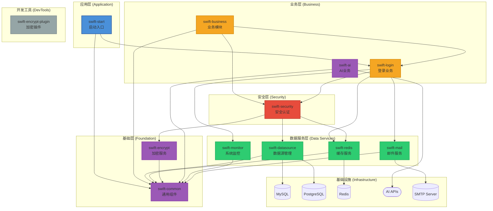

# SwiftFrame

<div align="center">


**企业级多模块快速开发框架**

[快速开始](#-快速开始) • [功能特性](#-核心特性) • [文档](#-文档) • [更新日志](CHANGELOG.md)

</div>

---

## 📖 简介

SwiftFrame 是一个基于 **Spring Boot 3.5** 和 **Java 21** 构建的企业级多模块快速开发框架。它集成了多数据源管理、自动化加解密、安全认证、AI集成、系统监控等核心功能，旨在为开发者提供一个开箱即用、高度可扩展的基础架构。

### 设计理念

- **模块化设计**：清晰的模块划分，职责单一，高内聚低耦合
- **开箱即用**：内置自动配置，减少繁琐的配置工作
- **安全优先**：多层安全防护，从配置加密到权限控制
- **现代化技术**：采用最新的技术栈，享受性能提升和新特性
- **生产就绪**：完善的监控、日志和异常处理机制

---

## ✨ 核心特性

### 🔐 安全防护

- **配置加密**：基于 Jasypt 的配置文件敏感信息加密
- **数据加解密**：内置 AES (GCM) 和 RSA 加解密工具类
- **自动化加密插件**：提供专用的 Maven 插件（`swift-encrypt-plugin`）用于配置文件和 SQL 文件的自动加解密
- **安全认证**：集成 Spring Security 和 JWT，支持灵活的权限校验与白名单配置
- **RBAC 权限模型**：内置用户、角色、权限三级权限管理体系

### 💾 数据管理

- **多数据源支持**：同时支持 MySQL 和 PostgreSQL 数据源，通过不同的 Mapper 包路径自动路由
- **高效 ORM 增强**：集成 MyBatis-Plus 3.5+，提供更简洁的数据库操作体验
- **Redis 缓存集成**：内置 Redis 缓存服务封装，支持分布式缓存场景
- **连接池管理**：集成 Druid 连接池，提供强大的监控和统计功能

### 🤖 AI 集成

- **多 AI 提供商支持**：支持 OpenAI、DeepSeek 等主流 AI 服务
- **流式响应**：支持 AI 流式输出，提升用户体验
- **统一接口**：提供统一的 AI 调用接口，便于切换不同 AI 服务
- **OpenAI 兼容**：支持所有 OpenAI 兼容的 API 接口
- **WebChat 功能**：完整的 AI 聊天对话系统
  - 供应商管理：动态管理多个 AI 服务提供商
  - 模型管理：灵活配置和管理不同 AI 模型
  - 会话管理：支持多会话、多用户的聊天场景
  - 消息管理：完整的消息历史记录和检索
  - 模型测试：快速测试模型连接和可用性

### 📊 系统监控

- **健康检查**：基于 Spring Boot Actuator 提供全面的健康检查
- **性能指标**：自动采集应用性能指标
- **Prometheus 集成**：支持 Prometheus 监控数据采集
- **自定义监控**：提供自定义健康指标扩展能力

### 🚀 开发体验

- **容器化部署**：全套 Docker / Docker-Compose 部署方案，支持一键启动应用及其依赖环境
- **API 文档自动化**：集成 SpringDoc OpenAPI 3 (Swagger UI)，自动生成交互式 API 接口文档
- **完善的响应封装**：统一的响应结果封装，支持普通响应和分页响应
- **全局异常处理**：统一的异常处理机制，提供友好的错误信息
- **邮件服务**：内置邮件发送功能，支持 SMTP 协议

---

## 📂 项目结构

```
SwiftFrame/
├── swift-common/           # 公共基础模块
│   ├── config/            # OpenAPI 配置
│   ├── constant/          # 常量定义
│   ├── domain/            # 通用领域对象（PubResult、PageResult）
│   ├── exception/         # 异常定义
│   ├── handler/           # 全局异常处理器
│   └── utils/             # 工具类（雪花ID生成器等）
│
├── swift-datasource/      # 数据源模块
│   └── config/            # 动态数据源配置、多数据库驱动支持
│
├── swift-encrypt/         # 加解密模块
│   ├── utils/             # AES/RSA 加解密工具类
│   └── config/            # Jasypt 配置
│
├── swift-encrypt-plugin/  # 加解密 Maven 插件
│   └── 用于自动化加密配置文件和 SQL 文件
│
├── swift-redis/           # Redis 缓存模块
│   └── config/            # Redis 配置和服务封装
│
├── swift-monitor/         # 系统监控模块
│   ├── config/            # Actuator 配置
│   └── health/            # 自定义健康指标
│
├── swift-security/        # 安全认证模块
│   ├── config/            # Security 配置
│   ├── filter/            # JWT 认证过滤器
│   ├── handler/           # 认证处理器
│   ├── service/           # 用户、角色、权限服务
│   ├── mapper/            # MySQL Mapper
│   └── utils/             # JWT 工具类
│
├── swift-ai/              # AI 通用调用模块
│   ├── client/            # AI 客户端（OpenAI 兼容）
│   ├── core/              # 核心模型（请求/响应）
│   ├── service/           # AI 服务接口
│   └── config/            # AI 配置
│
├── swift-login/           # 登录业务模块
│   ├── controller/        # 登录控制器
│   └── service/           # 登录业务逻辑
│
├── swift-business/        # 默认业务模块
│   ├── controller/        # 业务控制器
│   ├── service/           # 业务服务
│   ├── mapper/            # 数据访问层
│   └── entity/            # 实体类
│
├── swift-mail/            # 邮件服务模块
│   └── service/           # 邮件发送服务
│
├── swift-start/           # 启动模块
│   ├── resources/         # 配置文件、SQL 脚本、静态资源
│   └── java/              # 主启动类
│
├── docs/                  # 项目文档
│   ├── mail-configuration-guide.md
│   ├── Mapper包结构说明.md
│   └── sys-config-usage-guide.md
│
└── scripts/               # 脚本工具
    └── docs/              # 文档生成脚本
```

---

## 🏗️ 系统架构

### 模块依赖架构图



### 项目拓扑图

```mermaid
graph TB
    subgraph START_MODULE ["swift-start (启动模块)"]
        START_APP["SwiftStartApplication<br/>主启动类"]
        START_CONFIG["application.yml<br/>配置文件"]
        START_SQL["sql/<br/>数据库脚本"]
        START_STATIC["static/<br/>静态资源"]
    end

    subgraph COMMON_MODULE ["swift-common (公共基础模块)"]
        COMMON_CONFIG["config/<br/>OpenAPI配置"]
        COMMON_CONSTANT["constant/<br/>常量定义"]
        COMMON_DOMAIN["domain/<br/>PubResult/PageResult"]
        COMMON_EXCEPTION["exception/<br/>异常定义"]
        COMMON_HANDLER["handler/<br/>全局异常处理器"]
        COMMON_UTILS["utils/<br/>工具类"]
    end

    subgraph DATASOURCE_MODULE ["swift-datasource (数据源模块)"]
        DS_CONFIG["config/<br/>动态数据源配置"]
        DS_MYSQL["mapper.mysql/<br/>MySQL Mapper"]
        DS_PG["mapper.postgresql/<br/>PostgreSQL Mapper"]
    end

    subgraph ENCRYPT_MODULE ["swift-encrypt (加解密模块)"]
        ENCRYPT_UTILS["utils/<br/>AES/RSA工具类"]
        ENCRYPT_CONFIG["config/<br/>Jasypt配置"]
    end

    subgraph ENCRYPT_PLUGIN ["swift-encrypt-plugin (加密插件)"]
        PLUGIN_MOJO["EncryptMojo<br/>加密插件"]
        PLUGIN_DECRYPT["DecryptMojo<br/>解密插件"]
    end

    subgraph REDIS_MODULE ["swift-redis (Redis缓存模块)"]
        REDIS_CONFIG["config/<br/>Redis配置"]
        REDIS_SERVICE["RedisService<br/>缓存服务"]
    end

    subgraph MONITOR_MODULE ["swift-monitor (系统监控模块)"]
        MONITOR_CONFIG["config/<br/>Actuator配置"]
        MONITOR_HEALTH["health/<br/>健康指标"]
    end

    subgraph SECURITY_MODULE ["swift-security (安全认证模块)"]
        SEC_CONFIG["config/<br/>Security配置"]
        SEC_FILTER["filter/<br/>JWT过滤器"]
        SEC_HANDLER["handler/<br/>认证处理器"]
        SEC_SERVICE["service/<br/>用户/角色/权限服务"]
        SEC_MAPPER["mapper/<br/>MySQL Mapper"]
        SEC_UTILS["utils/<br/>JWT工具类"]
    end

    subgraph LOGIN_MODULE ["swift-login (登录业务模块)"]
        LOGIN_CONTROLLER["controller/<br/>登录控制器"]
        LOGIN_SERVICE["service/<br/>登录业务逻辑"]
    end

    subgraph BUSINESS_MODULE ["swift-business (默认业务模块)"]
        BIZ_CONTROLLER["controller/<br/>业务控制器"]
        BIZ_SERVICE["service/<br/>业务服务"]
        BIZ_MAPPER["mapper/<br/>数据访问层"]
        BIZ_ENTITY["entity/<br/>实体类"]
    end

    subgraph AI_MODULE ["swift-ai (AI业务模块)"]
        AI_CLIENT["client/<br/>AI客户端"]
        AI_CORE["core/<br/>核心模型"]
        AI_SERVICE["service/<br/>AI服务"]
        AI_CONFIG["config/<br/>AI配置"]
        AI_CONTROLLER["controller/<br/>AI控制器"]
        AI_ENTITY["entity/<br/>AI实体"]
    end

    subgraph MAIL_MODULE ["swift-mail (邮件服务模块)"]
        MAIL_SERVICE["service/<br/>邮件发送服务"]
    end

    subgraph DOCS ["docs (项目文档)"]
        DOCS_AI["AI模块前端开发文档.md"]
        DOCS_MODEL["模型供应商系统设计文档.md"]
        DOCS_RAG["RAG知识库实现计划.md"]
        DOCS_API["api-docs/<br/>API文档"]
    end

    subgraph SCRIPTS ["scripts (脚本工具)"]
        SCRIPTS_DOCS["docs/<br/>文档生成脚本"]
    end

    %% 模块间依赖关系
    START_APP -.->|依赖| LOGIN_MODULE
    START_APP -.->|依赖| BUSINESS_MODULE
    START_APP -.->|依赖| COMMON_MODULE
    
    LOGIN_MODULE -.->|依赖| SECURITY_MODULE
    LOGIN_MODULE -.->|依赖| REDIS_MODULE
    LOGIN_MODULE -.->|依赖| MONITOR_MODULE
    LOGIN_MODULE -.->|依赖| MAIL_MODULE
    
    BUSINESS_MODULE -.->|依赖| SECURITY_MODULE
    BUSINESS_MODULE -.->|依赖| COMMON_MODULE
    
    SECURITY_MODULE -.->|依赖| REDIS_MODULE
    SECURITY_MODULE -.->|依赖| DATASOURCE_MODULE
    SECURITY_MODULE -.->|依赖| ENCRYPT_MODULE
    
    DATASOURCE_MODULE -.->|依赖| COMMON_MODULE
    REDIS_MODULE -.->|依赖| COMMON_MODULE
    MONITOR_MODULE -.->|依赖| COMMON_MODULE
    MAIL_MODULE -.->|依赖| COMMON_MODULE
    ENCRYPT_MODULE -.->|依赖| COMMON_MODULE
    AI_MODULE -.->|依赖| COMMON_MODULE
    
    %% 样式定义
    style START_MODULE fill:#4a90d9,stroke:#2c5aa0,stroke-width:3px
    style COMMON_MODULE fill:#9b59b6,stroke:#8e44ad,stroke-width:3px
    style DATASOURCE_MODULE fill:#2ecc71,stroke:#27ae60,stroke-width:3px
    style ENCRYPT_MODULE fill:#9b59b6,stroke:#8e44ad,stroke-width:3px
    style ENCRYPT_PLUGIN fill:#95a5a6,stroke:#7f8c8d,stroke-width:3px
    style REDIS_MODULE fill:#2ecc71,stroke:#27ae60,stroke-width:3px
    style MONITOR_MODULE fill:#2ecc71,stroke:#27ae60,stroke-width:3px
    style SECURITY_MODULE fill:#e74c3c,stroke:#c0392b,stroke-width:3px
    style AI_MODULE fill:#9b59b6,stroke:#8e44ad,stroke-width:3px
    style LOGIN_MODULE fill:#f5a623,stroke:#d48806,stroke-width:3px
    style BUSINESS_MODULE fill:#f5a623,stroke:#d48806,stroke-width:3px
    style MAIL_MODULE fill:#2ecc71,stroke:#27ae60,stroke-width:3px
    style DOCS fill:#3498db,stroke:#2980b9,stroke-width:2px
    style SCRIPTS fill:#34495e,stroke:#2c3e50,stroke-width:2px
```



### 分层说明

#### 应用层
- **swift-start**: 应用启动入口，依赖业务层和基础层模块

#### 业务层
- **swift-login**: 用户登录、认证、注册等业务逻辑
- **swift-business**: 默认业务模块，提供业务逻辑实现
- **swift-ai**: AI业务模块，提供AI对话、供应商管理、模型管理等AI相关业务功能

#### 安全层
- **swift-security**: 基于 Spring Security 和 JWT 的认证授权、权限控制
  - 依赖：swift-redis、swift-datasource、swift-encrypt
  - 功能：用户认证、JWT 令牌管理、RBAC 权限控制、白名单配置

#### 数据服务层
- **swift-datasource**: 多数据源支持（MySQL/PostgreSQL）、MyBatis Plus 集成
- **swift-redis**: Redis 缓存服务封装
- **swift-monitor**: 系统监控模块，基于 Spring Boot Actuator
- **swift-mail**: 邮件服务模块

#### 基础层
- **swift-common**: 通用工具类、统一响应结果、全局异常处理、OpenAPI 配置
- **swift-encrypt**: AES/RSA 加解密工具、Jasypt 配置加密

#### 开发工具
- **swift-encrypt-plugin**: Maven 插件，用于构建时配置文件和 SQL 文件的自动加解密

**架构原则**: 
- 依赖单向向下，高层模块依赖低层模块，禁止跨层调用
- 各模块内部集成自动配置能力，开箱即用
- 模块职责单一，高内聚低耦合

---

## 🛠️ 技术栈

### 核心框架
| 技术 | 版本 | 说明 |
|------|------|------|
| Java | 21 | 编程语言 |
| Spring Boot | 3.5.1 | 应用框架 |
| Spring Security | 6.5.0 | 安全框架 |
| Lombok | - | 代码简化 |

### 数据存储
| 技术 | 版本 | 说明 |
|------|------|------|
| MySQL | 9.3.0 | 关系型数据库 |
| PostgreSQL | 15+ | 关系型数据库 |
| Redis | 7.0+ | 缓存数据库 |
| Druid | 1.2.23 | 数据库连接池 |
| MyBatis-Plus | 3.5.12 | ORM 框架 |

### 安全加密
| 技术 | 版本 | 说明 |
|------|------|------|
| JJWT | 0.12.6 | JWT 令牌生成 |
| Jasypt | 3.0.5 | 配置加密 |
| AES | GCM | 对称加密 |
| RSA | 2048 | 非对称加密 |

### AI 集成
| 技术 | 说明 |
|------|------|
| OpenAI | GPT-4o 等模型 |
| DeepSeek | deepseek-chat 等模型 |
| 自定义 | 支持自定义 OpenAI 兼容接口 |

### 监控与文档
| 技术 | 版本 | 说明 |
|------|------|------|
| Spring Boot Actuator | - | 应用监控 |
| Prometheus | - | 监控数据采集 |
| SpringDoc OpenAPI | 2.8.1 | API 文档 |

---

## 🏁 快速开始

### 环境要求

- **JDK 21+**
- **Maven 3.9+**
- **Docker & Docker Compose** (可选，用于快速部署)

### 本地运行

#### 1. 克隆项目

```bash
git clone https://github.com/SHOOTING-STAR-C/SwiftFrame.git
cd SwiftFrame
```

#### 2. 安装依赖并编译

```bash
mvn clean install -DskipTests
```

#### 3. 配置数据库

修改 `swift-start/src/main/resources/application-dev.yml` 中的数据库连接信息：

```yaml
spring:
  datasource:
    mysql:
      url: jdbc:mysql://localhost:3306/swift?useUnicode=true&characterEncoding=utf8&useSSL=false&serverTimezone=Asia/Shanghai
      username: root
      password: root
    postgresql:
      url: jdbc:postgresql://localhost:5432/swift
      username: postgres
      password: root
  data:
    redis:
      host: localhost
      port: 6379
```

#### 4. 启动应用

运行 `com.star.swiftStart.SwiftStartApplication`

#### 5. 访问应用

- **应用地址**: `http://localhost:8081/swift`
- **Swagger UI**: `http://localhost:8081/swift/swagger-ui.html`
- **健康检查**: `http://localhost:8081/swift/actuator/health`

---

## 🐳 Docker 部署

项目支持使用 `docker-compose` 一键启动完整环境：

### 启动服务

```bash
docker-compose up -d --build
```

### 服务说明

| 服务 | 地址 | 用户名/密码 |
|------|------|-------------|
| Application | http://localhost:8081/swift | - |
| MySQL | localhost:3306 | root/root |
| PostgreSQL | localhost:5432 | postgres/root |
| Redis | localhost:6379 | - |
| Swagger UI | http://localhost:8081/swift/swagger-ui.html | - |
| 健康检查 | http://localhost:8081/swift/actuator/health | - |

### 停止服务

```bash
docker-compose down
```

---

## 🔐 核心功能

### 多数据源使用

框架支持同时配置 MySQL 和 PostgreSQL 数据源，通过不同的 Mapper 包路径自动路由到对应的数据源：

#### MySQL 数据源 Mapper

```java
// 包路径：com.star.**.mapper.mysql
package com.star.swiftSecurity.mapper.mysql;

@Mapper
public interface SwiftUserMapper extends BaseMapper<SwiftUser> {
    // 自动使用 MySQL 数据源
}
```

#### PostgreSQL 数据源 Mapper

```java
// 包路径：com.star.**.mapper.postgresql
package com.star.swiftSecurity.mapper.postgresql;

@Mapper
public interface PgUserMapper extends BaseMapper<PgUser> {
    // 自动使用 PostgreSQL 数据源
}
```

#### 配置说明

- **MySQL Mapper 扫描路径**: `com.star.**.mapper.mysql`
- **PostgreSQL Mapper 扫描路径**: `com.star.**.mapper.postgresql`
- 每个数据源有独立的 SqlSessionFactory 和配置
- 通过包路径自动识别并路由到对应的数据源

### 配置文件加密

使用 `swift-encrypt-plugin` 插件对配置文件中的敏感信息进行加密：

#### 加密配置文件

```bash
mvn swift-encrypt-plugin:encrypt-config -Dapp.env=dev
```

#### 解密配置文件

```bash
mvn swift-encrypt-plugin:decrypt-config -Dapp.env=dev
```

#### 配置示例

```yaml
spring:
  datasource:
    password: ENC(加密后的密码)
```

### SQL 文件加密

使用 `swift-encrypt-plugin` 插件对 SQL 文件中的敏感数据进行加密：

#### 加密 SQL 文件

```bash
# 加密默认目录（src/main/resources/sql）下的所有 SQL 文件
mvn swift-encrypt-plugin:encrypt-sql -Dapp.env=dev

# 指定 SQL 文件目录
mvn swift-encrypt-plugin:encrypt-sql -DsqlDirPath=src/main/resources/sql -Dapp.env=dev

# 不递归处理子目录
mvn swift-encrypt-plugin:encrypt-sql -Drecursive=false -Dapp.env=dev
```

#### 解密 SQL 文件

```bash
# 解密默认目录下的所有 SQL 文件
mvn swift-encrypt-plugin:decrypt-sql -Dapp.env=dev

# 指定 SQL 文件目录
mvn swift-encrypt-plugin:decrypt-sql -DsqlDirPath=src/main/resources/sql -Dapp.env=dev
```

#### SQL 文件使用示例

```sql
-- 在 SQL 文件中使用 DEC() 标记需要加密的数据
INSERT INTO sys_config (config_key, config_value, config_type, description)
VALUES ('spring.mail.password', 'DEC(你的密码)', 'MAIL', '邮件发送密码');

-- 加密后会自动转换为
INSERT INTO sys_config (config_key, config_value, config_type, description)
VALUES ('spring.mail.password', 'ENC(加密后的密文)', 'MAIL', '邮件发送密码');
```

#### 插件参数说明

| 参数 | 说明 | 默认值 |
|------|------|--------|
| `sqlDirPath` | SQL 文件目录路径 | `${project.basedir}/src/main/resources/sql` |
| `recursive` | 是否递归处理子目录 | `true` |
| `configFilePath` | 配置文件路径 | `${project.basedir}/src/main/resources/application-${app.env}.yml` |
| `app.env` | 环境标识 | dev/test/prod |

### AI 服务调用

使用统一的 AI 服务接口调用 AI 功能：

```java
@Autowired
private AiService aiService;

public void chatWithAI() {
    // 构建消息
    List<Message> messages = List.of(
        new Message("user", "你好，请介绍一下 SwiftFrame")
    );
    
    // 调用 AI 服务
    ChatResponse response = aiService.chat(messages);
    
    // 流式响应
    aiService.streamChat(messages, chunk -> {
        System.out.println(chunk.getContent());
    });
}
```

### 安全认证

框架内置了完整的安全认证体系：

#### 用户登录

```bash
POST /swift/auth/login
Content-Type: application/json

{
    "username": "admin",
    "password": "123456"
}
```

#### JWT 令牌

- **访问令牌有效期**: 2小时（可配置）
- **刷新令牌有效期**: 7天（可配置）

#### 权限控制

```java
@PreAuthorize("hasAuthority('user:read')")
public List<User> getUsers() {
    return userService.list();
}
```

### 系统监控

框架提供了丰富的监控端点：

| 端点 | 说明 |
|------|------|
| `/actuator/health` | 健康检查 |
| `/actuator/info` | 应用信息 |
| `/actuator/metrics` | 性能指标 |
| `/actuator/prometheus` | Prometheus 数据 |
| `/actuator/env` | 环境信息 |
| `/actuator/loggers` | 日志级别 |
| `/actuator/threaddump` | 线程转储 |
| `/actuator/heapdump` | 堆转储 |

---

## 📊 数据库设计

### 核心表结构

框架内置了完整的 RBAC 权限管理体系：

| 表名 | 说明 |
|------|------|
| `swift_user` | 用户表 |
| `swift_role` | 角色表 |
| `swift_authority` | 权限表 |
| `swift_user_role` | 用户角色关联表 |
| `swift_role_authority` | 角色权限关联表 |

### 初始化数据

系统启动时会自动初始化以下数据：

- **默认管理员账号**: `admin` / `123456`
- **默认角色**: `ROLE_ADMIN`, `ROLE_USER`
- **默认权限**: 完整的权限体系

---

## 📝 配置说明

### 环境配置

项目支持多环境配置：

- **开发环境**: `application-dev.yml`
- **测试环境**: `application-test.yml`
- **生产环境**: `application-prod.yml`

### Maven Profile

使用 Maven Profile 切换环境：

```bash
# 开发环境（默认）
mvn clean package

# 测试环境
mvn clean package -Ptest

# 生产环境
mvn clean package -Pprod
```

### 核心配置项

```yaml
swift:
  # 安全配置
  security:
    auth:
      white-list: /auth/publicKey,/auth/login,/auth/register
  
  # AI 配置
  ai:
    enabled: true
    default-provider: openai
    providers:
      openai:
        enabled: true
        api-key: your-openai-api-key
        base-url: https://api.openai.com
        model: gpt-4o
  
  # 监控配置
  monitor:
    enabled: true
```

---

## 📚 文档

- **[更新日志](CHANGELOG.md)**: 版本更新和 Bug 修复记录
- **API 文档**: 启动应用后访问 `/swagger-ui.html`

---

## 🤝 贡献指南

欢迎贡献代码、报告问题或提出建议！

1. Fork 本仓库
2. 创建特性分支 (`git checkout -b feature/AmazingFeature`)
3. 提交更改 (`git commit -m 'Add some AmazingFeature'`)
4. 推送到分支 (`git push origin feature/AmazingFeature`)
5. 开启 Pull Request

---

## 📋 更新日志

详细的版本更新和 Bug 修复记录请查看：[CHANGELOG.md](CHANGELOG.md)

---

## 📜 许可证

本项目采用 [GNU Affero General Public License v3.0 (AGPL-3.0)](LICENSE) 开源许可证。

---

## 🙏 致谢

感谢所有为 SwiftFrame 做出贡献的开发者！

---

## 📮 联系方式

- **项目地址**: https://github.com/SHOOTING-STAR-C/SwiftFrame
- **问题反馈**: https://github.com/SHOOTING-STAR-C/SwiftFrame/issues

---

<div align="center">

**SwiftFrame** - 让开发更快速，让架构更优雅！

Made with ❤️ by SHOOTING-STAR-C

</div>
